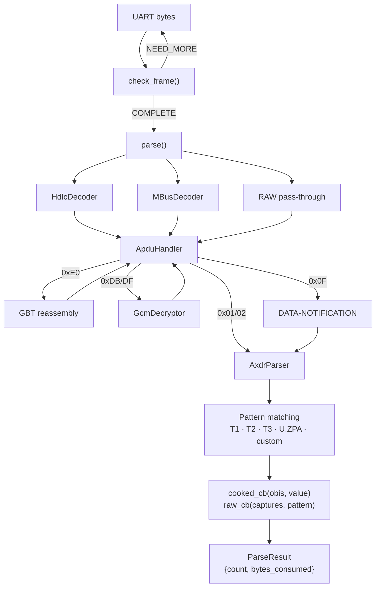

# dlms_parser — Architecture

## Component Diagram



## Data Flow

```
UART → check_frame() → COMPLETE / NEED_MORE / ERROR
                          │
                          ▼
                       parse()
                          │
            ┌─────────────┼─────────────┐
            HDLC          MBUS          RAW
            │             │             │
            └──────┬──────┘             │
                   ▼                    │
              ApduHandler ◄─────────────┘
                   │
         ┌────────┼────────┬──────────┐
         0xE0     0xDB/DF  0x0F       0x01/02
         GBT      GCM      DATA-NOT   raw AXDR
         │        │        │          │
         └──►     └──►     ▼          ▼
         re-enter  re-enter AxdrParser
                           │
                    pattern matching
                           │
                    callbacks + ParseResult
```

## Module Responsibilities

| Module | Role |
|---|---|
| **DlmsParser** | Facade — owns all components, exposes `check_frame()` and `parse()` |
| **HdlcDecoder** | Strips 0x7E framing, validates CRC, reassembles segmented frames |
| **MBusDecoder** | Strips 0x68 framing, validates checksum, concatenates multi-frame |
| **ApduHandler** | Scans for APDU tag, handles GBT/encryption/DATA-NOTIFICATION |
| **GcmDecryptor** | AES-128-GCM decryption (BearSSL / PSA / mbedTLS) |
| **AxdrParser** | Walks STRUCTURE/ARRAY tree, matches DSL patterns, emits objects |
| **Logger** | Static logging interface, silent by default |
| **utils** | Value conversion, OBIS/datetime formatting, type helpers |

## Caller vs Library Responsibilities

The library is **stateless** between calls — it does not buffer or accumulate data.

| Responsibility | Owner |
|---|---|
| Reading bytes from UART | Caller |
| Detecting frame boundaries (0x7E / 0x16) | Caller |
| Accumulating multi-frame messages | Caller (using `check_frame()` to know when done) |
| Decoding transport framing (HDLC / M-Bus) | Library |
| Reassembling GBT blocks | Library |
| Decrypting AES-GCM | Library |
| Walking AXDR structure and matching patterns | Library |
| Delivering parsed values via callbacks | Library |

Typical caller loop:

```
read frame from UART → append to buffer → check_frame()
  ├─ NEED_MORE → read more
  ├─ ERROR → clear buffer, resync
  └─ COMPLETE → parse() → clear buffer
```
