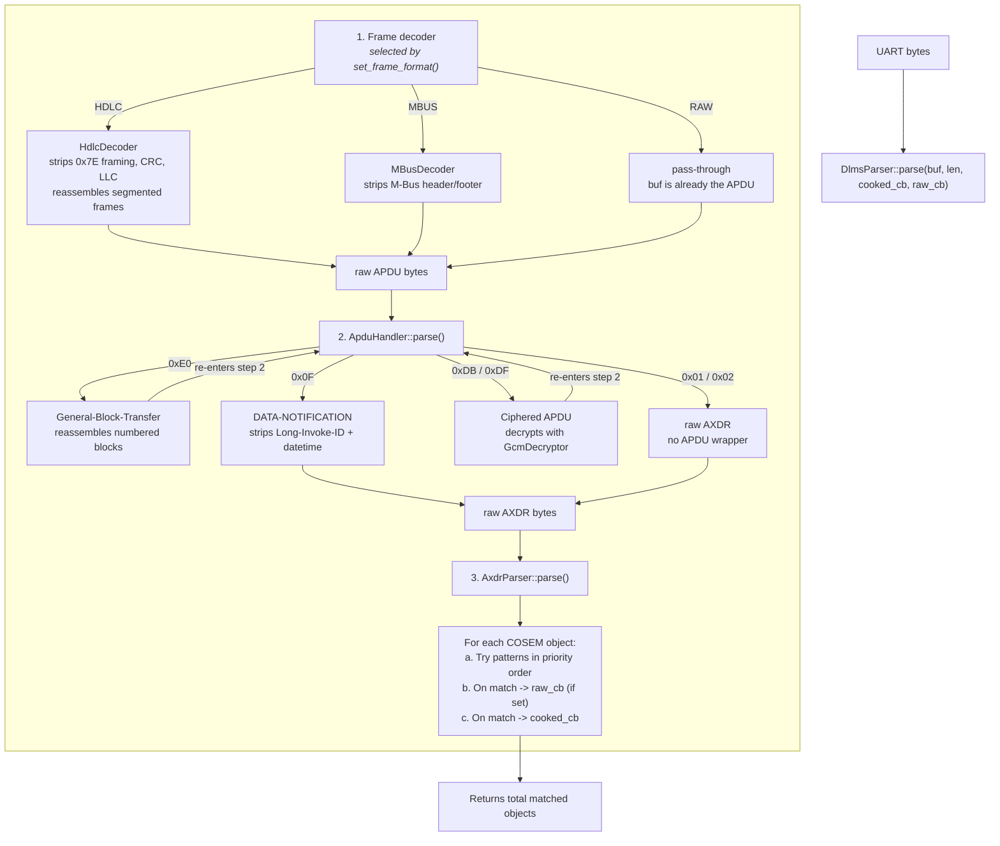

# dlms_parser — How to Use

This guide explains how to configure the parser, how frames move through the decoding pipeline, how to work with patterns and callbacks, and how to troubleshoot common integration issues.

## Overview

`DlmsParser` is a facade over the full processing chain:

1. Decode the transport frame if needed
2. Unwrap or decrypt the APDU
3. Parse the AXDR payload
4. Match known object layouts using descriptor patterns
5. Emit values through callbacks

The parser is stateless at the frame level. Call `parse()` once per complete frame.

## How Parsing Works



Key behavior:

- `parse()` is called once per complete frame
- the APDU handler **scans** the buffer byte-by-byte for the first recognized tag (`0xE0`, `0x0F`, `0xDB`, `0xDF`, `0x01`, `0x02`) — unknown leading bytes are skipped
- GBT blocks are reassembled and the result re-enters APDU parsing
- encrypted APDUs are decrypted and the plaintext re-enters APDU parsing
- `raw_cb` runs before `cooked_cb` for the same match
- patterns are tried in ascending priority order; first match wins

## Choosing The Frame Format

Choose the transport wrapper the meter actually sends:

```cpp
parser.set_frame_format(dlms_parser::FrameFormat::RAW);
parser.set_frame_format(dlms_parser::FrameFormat::HDLC);
parser.set_frame_format(dlms_parser::FrameFormat::MBUS);
```

`RAW` means the buffer already starts with a supported DLMS/APDU payload. In practice that usually means one of:

| First byte | Meaning                                                                    |
|------------|----------------------------------------------------------------------------|
| `0x0F`     | `DATA-NOTIFICATION`                                                        |
| `0xE0`     | `General-Block-Transfer` (reassembles blocks, then re-enters APDU parsing) |
| `0xDB`     | `General-GLO-Ciphering` (encrypted, needs key)                             |
| `0xDF`     | `General-DED-Ciphering` (encrypted, needs key)                             |
| `0x01`     | raw AXDR array                                                             |
| `0x02`     | raw AXDR structure                                                         |

Some meters produce invalid or non-standard integrity checks. If you need to accept such frames:

```cpp
parser.set_skip_crc_check(true);
```

This affects HDLC and M-Bus only. It has no effect in `RAW` mode.

## Providing A Work Buffer

The parser performs all transforms (frame decoding, GBT reassembly, decryption,
APDU unwrapping) in a single caller-owned work buffer. **No heap allocation occurs
during `parse()`.**

```cpp
uint8_t work_buf[1024];  // stack, static, or PSRAM — caller controls placement
parser.set_work_buffer(work_buf, sizeof(work_buf));
```

The work buffer must be at least as large as the biggest raw frame the meter sends.
If no work buffer is set, or the frame exceeds its capacity, `parse()` returns
`{0, 0}` and logs an error.

Typical sizes:

| Scenario                                       | Recommended size |
|------------------------------------------------|------------------|
| Unencrypted single-frame HDLC                  | 256–512 bytes    |
| Encrypted single-frame M-Bus                   | 512 bytes        |
| Multi-frame HDLC or GBT (e.g. Landis+Gyr E450) | 1024 bytes       |

The input buffer passed to `parse()` is **not modified** — data is copied into the
work buffer first, then transformed in-place through each pipeline stage. Each stage
produces output that is equal or smaller in size, so the buffer never grows.

## Accumulating Frames

Some meters split a single DLMS message across multiple transport frames (HDLC
segmentation, GBT blocks, multi-frame M-Bus). The library does **not** accumulate
frames internally — that is the caller's responsibility.

Use `check_frame()` to determine when the buffer is ready for `parse()`:

```cpp
std::vector<uint8_t> buffer;

while (uart_has_data()) {
    // Read bytes until the next frame delimiter (0x7E for HDLC, 0x16 for M-Bus)
    auto chunk = read_next_frame_from_uart();
    buffer.insert(buffer.end(), chunk.begin(), chunk.end());

    auto status = parser.check_frame(buffer.data(), buffer.size());

    if (status == dlms_parser::FrameStatus::ERROR) {
        buffer.clear();  // bad data — discard and resync
        continue;
    }

    if (status == dlms_parser::FrameStatus::NEED_MORE) {
        continue;  // segmented or multi-frame — keep reading
    }

    // COMPLETE — parse the accumulated buffer
    auto [count, consumed] = parser.parse(buffer.data(), buffer.size(), on_value);
    buffer.clear();
}
```

`check_frame()` is stateless and cheap — it only inspects frame headers (length
fields, segmentation bits, stop bytes). It never copies or stores data.

| Return value | Meaning                                  | Action                    |
|--------------|------------------------------------------|---------------------------|
| `COMPLETE`   | buffer contains a complete message       | call `parse()`            |
| `NEED_MORE`  | more frames expected (segmentation, GBT) | keep reading from UART    |
| `ERROR`      | invalid framing                          | discard buffer and resync |

For `RAW` mode, `check_frame()` always returns `COMPLETE` — the caller is
responsible for delivering a complete APDU buffer.

## Working With Encrypted Frames

If the meter encrypts push telegrams, install the AES-128-GCM key before parsing:

```cpp
std::array<uint8_t, 16> key = {0x00, 0x01, 0x02, /* ... */ 0x0F};
parser.set_decryption_key(key);
```

Or:

```cpp
std::vector<uint8_t> key_vec = { /* exactly 16 bytes */ };
parser.set_decryption_key(key_vec);
```

If the frame is not encrypted, skip this step.

## Loading And Writing Patterns

The parser starts with no registered AXDR patterns. Load the built-ins first unless you want full control:

```cpp
parser.load_default_patterns();
```

Built-in patterns:

| Name    | Priority | Typical use                               |
|---------|---------:|-------------------------------------------|
| `T1`    |       10 | class ID, tagged OBIS, scaler, value      |
| `T2`    |       20 | tagged OBIS, value, scaler-unit structure |
| `T3`    |       30 | value first, class ID, scaler-unit, OBIS  |
| `U.ZPA` |       40 | untagged ZPA/Aidon-style layouts          |

Register a custom pattern when your meter emits a different structure:

```cpp
// Simple — name="CUSTOM", priority=0 (tried before built-ins)
parser.register_pattern("TC, TO, TDTM");

// Named with explicit priority
parser.register_pattern("MyPattern", "TO, TV, S(TS, TU)", 5);

// With default OBIS — used when the pattern captures no OBIS code
const uint8_t meter_obis[] = {0, 0, 96, 1, 0, 255};  // 0.0.96.1.0.255
parser.register_pattern("MeterID", "L, TSTR", 0, meter_obis);
```

Pattern priority matters:

- lower priority number is tried first
- `register_pattern(dsl)` uses priority `0`
- built-ins start at priority `10`

Common examples:

```cpp
parser.register_pattern("TC, TO, TDTM");          // datetime value
parser.register_pattern("C, O, A, V, TS, TU");    // untagged flat
parser.register_pattern("TO, TV, S(TS, TU)");     // tagged with scaler-unit
parser.register_pattern("TO, TV");                 // flat OBIS + value pairs (no scaler)
parser.register_pattern("L, TSTR");                // last element as string
parser.register_pattern("TOW, TV, TSU");           // Landis+Gyr swapped OBIS
```

The full token reference is in [REFERENCE.md](REFERENCE.md).

## Parsing Frames

Once the parser is configured, call `parse()` with one complete frame:

```cpp
size_t objects = parser.parse(buf, len, on_value);
```

Minimal example:

```cpp
#include "dlms_parser/dlms_parser.h"

dlms_parser::DlmsParser parser;
parser.load_default_patterns();

auto on_value = [](const char* obis_code, float float_val, const char* str_val, bool is_numeric) {
    if (is_numeric) {
        printf("%s = %.3f\n", obis_code, float_val);
    } else {
        printf("%s = \"%s\"\n", obis_code, str_val);
    }
};

size_t objects_found = parser.parse(frame_bytes, frame_len, on_value);
printf("%zu objects found\n", objects_found);
```

## Using Callbacks

The cooked callback is the default integration point:

```cpp
void on_value(const char* obis_code,
              float float_val,
              const char* str_val,
              bool is_numeric)
{
    if (is_numeric) {
        store_reading(obis_code, float_val);
    } else {
        store_string(obis_code, str_val);
    }
}
```

Behavior:

- numeric values arrive with the scaler already applied
- string-like values are returned through `str_val`
- if a pattern captured no OBIS code, OBIS `0.0.0.0.0.0` is used by default. This can be overridden per-pattern using the `default_obis` overload:
  ```cpp
  const uint8_t obis[] = {0, 0, 96, 1, 0, 255};  // 0.0.96.1.0.255
  parser.register_pattern("MeterID", "L, TSTR", 0, obis);
  ```

The raw callback is useful when you need access to the original value bytes, scaler, or unit:

```cpp
void on_raw(const dlms_parser::AxdrCaptures& c,
            const dlms_parser::AxdrDescriptorPattern& pat)
{
    printf("pattern '%s' matched, class=%u\n", pat.name.c_str(), c.class_id);
}

parser.parse(buf, len, on_value, on_raw);
parser.parse(buf, len, on_value);
parser.parse(buf, len, nullptr, on_raw);
```

## Logging

Logging is silent by default. Install a logger to see parser diagnostics:

```cpp
dlms_parser::Logger::set_log_function(
    [](dlms_parser::LogLevel level, const char* fmt, va_list args) {
        if (level >= dlms_parser::LogLevel::WARNING) {
            vprintf(fmt, args);
            putchar('\n');
        }
    }
);
```

For ESPHome-style environments:

```cpp
dlms_parser::Logger::set_log_function(
    [](dlms_parser::LogLevel level, const char* fmt, va_list args) {
        char buf[256];
        vsnprintf(buf, sizeof(buf), fmt, args);
        switch (level) {
            case dlms_parser::LogLevel::ERROR:   ESP_LOGE("dlms", "%s", buf); break;
            case dlms_parser::LogLevel::WARNING: ESP_LOGW("dlms", "%s", buf); break;
            case dlms_parser::LogLevel::INFO:    ESP_LOGI("dlms", "%s", buf); break;
            default:                             ESP_LOGD("dlms", "%s", buf); break;
        }
    }
);
```

## Examples

ESPHome-style integration:

```cpp
#include "dlms_parser/dlms_parser.h"

class MyMeterComponent {
    dlms_parser::DlmsParser parser_;
    uint8_t work_buf_[1024]{};

public:
    void setup() {
        parser_.set_work_buffer(work_buf_, sizeof(work_buf_));
        parser_.load_default_patterns();
        parser_.set_frame_format(dlms_parser::FrameFormat::HDLC);

        parser_.set_decryption_key({0x00,0x01,0x02,0x03,
                                    0x04,0x05,0x06,0x07,
                                    0x08,0x09,0x0A,0x0B,
                                    0x0C,0x0D,0x0E,0x0F});
    }

    void on_frame(const uint8_t* buf, size_t len) {
        auto cooked = [this](const char* obis, float val, const char* str, bool numeric) {
            if (numeric) {
                publish_sensor(obis, val);
            }
        };

        size_t n = parser_.parse(buf, len, cooked);
        if (n == 0) {
            ESP_LOGW("dlms", "Frame parsed but no objects matched");
        }
    }

    void publish_sensor(const char* obis, float val) { /* ... */ }
};
```

Examples of meter-specific customization from the test suite:

- Salzburg Netz: `TO, TDTM` and `S(TO, TV)`
- Iskra 550: `S(TO, TV)`
- Aidon HAN: `S(TO, TV)`
- Landis+Gyr ZMF100: `set_skip_crc_check(true)`, `S(TO, TDTM)`, `S(TO, TV)`, `TOW, TV, TSU`
- Landis+Gyr E450: decryption key, `TO, TV` (3 HDLC frames with General-Block-Transfer + encryption)
- Netz NOE P1: decryption key plus `L, TSTR`

## Troubleshooting

| Symptom                                  | Likely cause                                                      |
|------------------------------------------|-------------------------------------------------------------------|
| `No work buffer set` error               | call `set_work_buffer()` before `parse()`                         |
| `Frame too large for work buffer`        | increase work buffer size                                         |
| `parse()` returns 0                      | no patterns loaded                                                |
| `parse()` returns 0 with patterns loaded | no pattern matched the AXDR layout                                |
| `HCS error` or `FCS error`               | wrong frame format, damaged frame, or non-standard CRC            |
| `checksum error`                         | M-Bus checksum mismatch                                           |
| encrypted APDU with no output            | decryption key was not set                                        |
| `Decryption failed`                      | wrong key or corrupted ciphertext                                 |
| values look scaled incorrectly           | inspect scaler/unit handling or use the cooked callback           |
| unsupported APDU warning                 | the meter uses a wrapper not handled by the library               |
| `GBT: truncated block`                   | incomplete General-Block-Transfer frame — buffer may be cut short |
| object captured with OBIS `0.0.0.0.0.0`  | pattern has no `TO`/`O` token — use `default_obis` overload       |

For exact callback signatures, token definitions, and public API details, see [REFERENCE.md](REFERENCE.md).
For the component diagram and module responsibilities, see [ARCHITECTURE.md](ARCHITECTURE.md).
