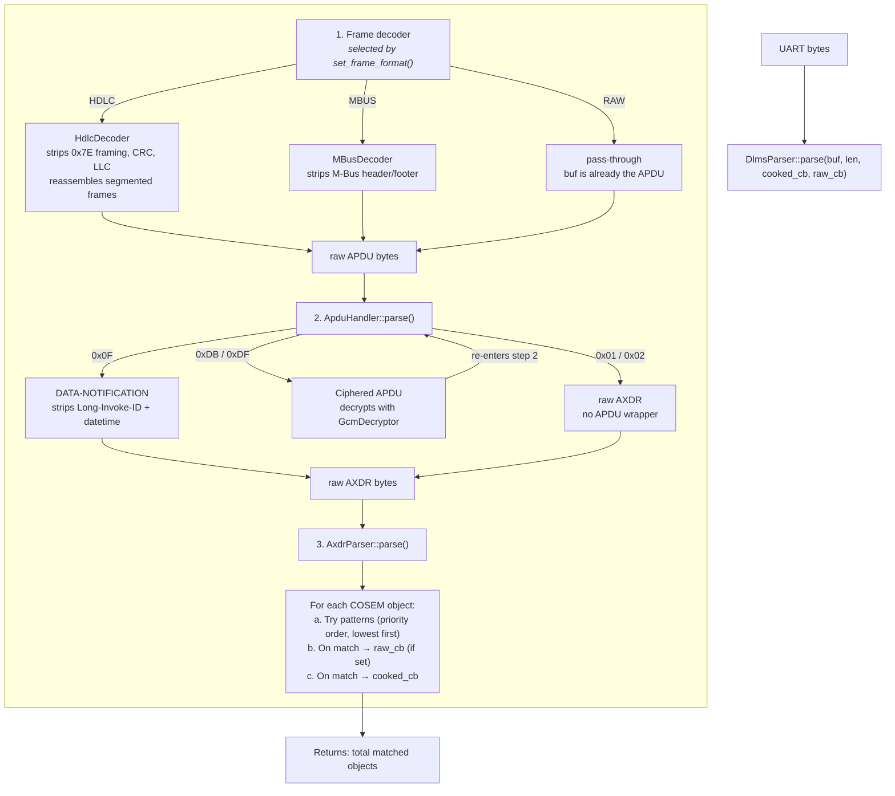
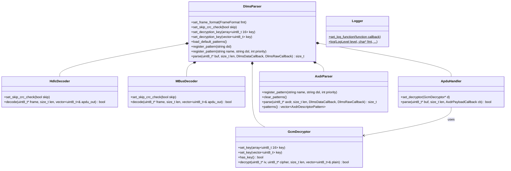

# dlms_parser — How to Use

A C++20 library for parsing DLMS/COSEM push telegrams from electricity meters.
Handles frame decoding (HDLC, M-Bus, raw), optional AES-128-GCM decryption,
APDU unwrapping, and AXDR pattern-matching to extract meter readings.

---

## Call Order — What Happens Inside `parse()`

Understanding the pipeline is essential for implementing meter reading correctly.



**Key rules:**
- `parse()` is stateless — call it once per complete frame.
- `raw_cb` fires **before** `cooked_cb` for the same object.
- Patterns are tried in priority order; first match wins; unmatched objects are silently skipped.
- Decryption is transparent: a ciphered APDU is decrypted and re-enters the APDU handler automatically.

---

## Quick Start

```cpp
#include "dlms_parser/dlms_parser.h"

dlms_parser::DlmsParser parser;
parser.load_default_patterns();  // T1, T2, T3, U.ZPA

// Called for every recognised COSEM object in the frame
auto on_value = [](const char* obis, float num, const char* str, bool is_numeric) {
    if (is_numeric) {
        printf("%s = %.3f\n", obis, num);
    } else {
        printf("%s = \"%s\"\n", obis, str);
    }
};

// Feed one complete frame (raw APDU, no extra framing)
size_t count = parser.parse(frame_bytes, frame_len, on_value);
printf("%zu objects found\n", count);
```

---

## Step 1 — Choose a Frame Format

The meter's serial output may wrap the APDU in a transport layer.
Tell the parser which one to strip before handing off to the APDU handler.

```cpp
// Default: buf IS the APDU (starts with 0x0F, 0xDB, 0xDF, 0x01, or 0x02)
parser.set_frame_format(dlms_parser::FrameFormat::RAW);

// HDLC (0x7E...0x7E): used by e.g. P1/DSMR meters, some Aidon meters
parser.set_frame_format(dlms_parser::FrameFormat::HDLC);

// M-Bus (0x68...0x68): used by Sagemcom, Iskraemeco, etc.
parser.set_frame_format(dlms_parser::FrameFormat::MBUS);
```

For **RAW** mode the APDU must start with one of:

| First byte | Meaning |
|---|---|
| `0x0F` | DATA-NOTIFICATION (most common push format) |
| `0xDB` | General-GLO-Ciphering (encrypted, needs key) |
| `0xDF` | General-DED-Ciphering (encrypted, needs key) |
| `0x01` | ARRAY — raw AXDR, no APDU wrapper (some HDLC meters) |
| `0x02` | STRUCTURE — raw AXDR, no APDU wrapper |

Some meters send frames with incorrect or non-standard CRC/checksum values
(e.g. Landis+Gyr). To accept such frames, disable the integrity check:

```cpp
parser.set_skip_crc_check(true);
```

This skips HCS + FCS validation for HDLC and checksum validation for M-Bus.
Has no effect in RAW mode. Default is `false` (checks enabled).

---

## Step 2 — Set a Decryption Key (if needed)

```cpp
// From a fixed array
std::array<uint8_t, 16> key = {0x00, 0x01, 0x02, /* ... */ 0x0F};
parser.set_decryption_key(key);

// Or from a vector (must be exactly 16 bytes)
std::vector<uint8_t> key_vec = { /* 16 bytes */ };
parser.set_decryption_key(key_vec);
```

If the frame is not encrypted, skip this step.
The GCM decryptor selects its backend at compile time:
- ESP8266 → BearSSL
- ESP32 IDF ≥ 6.0 → PSA Crypto
- All others (Linux, MSVC, older IDF) → mbedTLS

---

## Step 3 — Load and Register Patterns

The parser starts with **no patterns**. Call `load_default_patterns()` to register
the four built-in patterns, then optionally add your own.

### Loading built-in patterns

```cpp
parser.load_default_patterns();  // registers T1, T2, T3, U.ZPA at priority 10, 20, 30, 40
```

### Built-in patterns

| Name | DSL | Prio | Typical use |
|---|---|---| --- |
| `T1` | `TC, TO, TS, TV` | 10 | Class ID + tagged OBIS + scaler + value |
| `T2` | `TO, TV, TSU` | 20 | Tagged OBIS + value + scaler-unit struct |
| `T3` | `TV, TC, TSU, TO` | 30 | Value first, class ID, scaler-unit, OBIS |
| `U.ZPA` | `F, C, O, A, TV` | 40 | Untagged (ZPA/Aidon-style) structure |

### DSL token reference

Tokens are comma-separated. Order must match the byte order in the AXDR stream.

| Token | Meaning | Hex example |
|---|---|---|
| `F` | First element guard — must be element 0 of the enclosing structure/array | *(no bytes — position check only)* |
| `L` | Last element guard — must be the final element of the enclosing structure/array | *(no bytes — position check only)* |
| `C` | Class ID — 2-byte uint16, **no** type tag | `00 03` (class 3 = Register) |
| `TC` | Tagged class ID — type byte `0x12` + 2-byte uint16 | `12 00 03` |
| `O` | OBIS code — 6-byte octet string, **no** type tag | `01 00 01 08 00 FF` (1.0.1.8.0.255) |
| `TO` | Tagged OBIS code — type byte `0x09` + length `0x06` + 6 bytes | `09 06 01 00 01 08 00 FF` |
| `TOW` | Tagged OBIS (wrong byte order) — `0x06` + `0x09` + 6 bytes. Landis+Gyr firmware bug | `06 09 01 00 1F 07 00 FF` |
| `A` | Attribute index — 1-byte uint8, **no** type tag | `02` (attribute 2) |
| `TA` | Tagged attribute — type byte (uint8/int8) + 1 byte | `11 02` or `0F 02` |
| `V` / `TV` | Generic value — any DLMS type, auto-converted to float or string | `06 00 00 07 A4` (uint32 = 1956) |
| `TSTR` | Tagged string — expects `0x09`, `0x0A`, or `0x0C` type tag + length + bytes | `09 08 38 34 38 39 35 31 32 36` ("84895126") |
| `TDTM` | Tagged 12-byte DATETIME — accepts `0x19` + 12B or `0x09 0x0C` + 12B | `19 07E7 04 01 ...` or `09 0C 07E7 04 01 ...` |
| `TS` | Tagged scaler — `0x0F` (int8) + exponent byte | `0F FF` (scaler = -1 → x0.1) |
| `TU` | Tagged unit enum — `0x16` (enum) + unit byte | `16 23` (unit 35 = V) |
| `TSU` | Tagged scaler-unit pair — shorthand for `S(TS, TU)` | `02 02 0F FF 16 23` (struct{-1, V}) |
| `S(x, y, ...)` | Inline sub-structure with N elements | `02 03` (struct with 3 elements) |
| `DN` | Go down — enter a nested structure | *(control token — no bytes)* |
| `UP` | Go up — exit a nested structure | *(control token — no bytes)* |

### Registering a pattern

```cpp
// Simple form — name defaults to "CUSTOM", priority defaults to 0 (tried first)
parser.register_pattern("TC, TO, TDTM");

// Full form — specify name and priority
parser.register_pattern("MyPattern", "TO, TV, S(TS, TU)", 5);
```

Custom patterns registered with the simple form get **priority 0**, so they are
tried **before** the built-ins (priority 10). The first match in priority order wins.

```cpp
// Meter sends: class_id(tagged), OBIS(tagged), datetime-as-octet-string
parser.register_pattern("TC, TO, TDTM");

// Untagged flat layout: class_id, OBIS, attr, value, scaler, unit
parser.register_pattern("C, O, A, V, TS, TU");

// Nested scaler-unit inside a sub-structure
parser.register_pattern("TO, TV, S(TS, TU)");

// Capture the last element as a string (e.g. meter number without OBIS)
parser.register_pattern("L, TSTR");

// Landis+Gyr firmware bug: OBIS tag bytes swapped (06 09 instead of 09 06)
parser.register_pattern("TOW, TV, TSU");
```

---

## Step 4 — Parse a Frame

Call `parse()` once you have a complete, framed buffer.

```cpp
size_t objects = parser.parse(buf, len, on_value);
```

### The cooked callback (`DlmsDataCallback`)

```cpp
void on_value(const char* obis_code,   // e.g. "1.0.1.8.0.255"
              float       float_val,   // numeric value (if is_numeric)
              const char* str_val,     // string value (if !is_numeric)
              bool        is_numeric)
{
    if (is_numeric) {
        // float_val already has the scaler applied: raw_value * 10^scaler
        store_reading(obis_code, float_val);
    } else {
        store_string(obis_code, str_val);
    }
}
```

Common OBIS codes:

| OBIS | Meaning |
|---|---|
| `1.0.1.8.0.255` | Active energy import (Wh or kWh) |
| `1.0.2.8.0.255` | Active energy export (Wh or kWh) |
| `1.0.1.7.0.255` | Instantaneous active power import (W) |
| `1.0.32.7.0.255` | L1 voltage (V) |
| `0.0.96.1.0.255` | Meter serial number (string) |

If a pattern captures a value but no OBIS code (e.g. `L, TSTR`), the object
is emitted with OBIS `0.0.0.0.0.0` as a placeholder.

### The raw callback (`DlmsRawCallback`) — advanced use

Gives access to the raw captured bytes before conversion. Useful when you need
the scaler/unit separately, or want to handle types the cooked callback cannot.

```cpp
void on_raw(const dlms_parser::AxdrCaptures& c,
            const dlms_parser::AxdrDescriptorPattern& pat)
{
    // c.obis        — pointer to 6-byte OBIS array (nullptr if not captured)
    // c.class_id    — COSEM class ID (e.g. 3 = register)
    // c.value_type  — DlmsDataType enum
    // c.value_ptr   — raw bytes of the value
    // c.value_len   — byte count of the value
    // c.has_scaler_unit
    // c.scaler      — signed exponent (10^scaler)
    // c.unit_enum   — DLMS unit code

    printf("pattern '%s' matched, class=%u\n", pat.name.c_str(), c.class_id);
}

parser.parse(buf, len, on_value, on_raw);  // both callbacks
parser.parse(buf, len, on_value);          // cooked only
parser.parse(buf, len, nullptr, on_raw);   // raw only
```

---

## Step 5 — Logging

By default all log output is suppressed. Install a handler to see it.

Log levels (from most to least verbose):

| Level | Typical content |
|---|---|
| `DEBUG` | Pattern matches, structure traversal, byte counts |
| `VERY_VERBOSE` | Individual element skips, type details |
| `VERBOSE` | Parsing warnings, datetime flags |
| `INFO` | Matched object details (OBIS, value, scaler) |
| `WARNING` | Frame errors, CRC failures, missing keys |
| `ERROR` | Decryption failures, fatal parse errors |

```cpp
dlms_parser::Logger::set_log_function(
    [](dlms_parser::LogLevel level, const char* fmt, va_list args) {
        if (level >= dlms_parser::LogLevel::WARNING) {
            vprintf(fmt, args);
            putchar('\n');
        }
    }
);
```

On ESPHome, map to `ESP_LOGx`:

```cpp
dlms_parser::Logger::set_log_function(
    [](dlms_parser::LogLevel level, const char* fmt, va_list args) {
        char buf[256];
        vsnprintf(buf, sizeof(buf), fmt, args);
        switch (level) {
            case dlms_parser::LogLevel::ERROR:   ESP_LOGE("dlms", "%s", buf); break;
            case dlms_parser::LogLevel::WARNING: ESP_LOGW("dlms", "%s", buf); break;
            case dlms_parser::LogLevel::INFO:    ESP_LOGI("dlms", "%s", buf); break;
            default:                             ESP_LOGD("dlms", "%s", buf); break;
        }
    }
);
```

---

## Complete ESPHome-style Example

```cpp
#include "dlms_parser/dlms_parser.h"

class MyMeterComponent {
    dlms_parser::DlmsParser parser_;

public:
    void setup() {
        parser_.load_default_patterns();
        parser_.set_frame_format(dlms_parser::FrameFormat::HDLC);

        // Only needed if meter encrypts its push telegrams
        parser_.set_decryption_key({0x00,0x01,0x02,0x03,
                                    0x04,0x05,0x06,0x07,
                                    0x08,0x09,0x0A,0x0B,
                                    0x0C,0x0D,0x0E,0x0F});

        // Install logger
        dlms_parser::Logger::set_log_function(
            [](dlms_parser::LogLevel lv, const char* fmt, va_list args) {
                char buf[256];
                vsnprintf(buf, sizeof(buf), fmt, args);
                ESP_LOGD("dlms", "%s", buf);
            });
    }

    // Call when a complete frame has been accumulated from UART
    void on_frame(const uint8_t* buf, size_t len) {
        auto cooked = [this](const char* obis, float val, const char* str, bool numeric) {
            if (numeric) {
                publish_sensor(obis, val);
            }
        };

        size_t n = parser_.parse(buf, len, cooked);
        if (n == 0) {
            ESP_LOGW("dlms", "Frame parsed but no objects matched");
        }
    }

    void publish_sensor(const char* obis, float val) { /* ... */ }
};
```

---

## Architecture — Class Diagram



---

## Public API Reference

### `DlmsParser` — main facade

| Method | Description |
|---|---|
| `set_frame_format(FrameFormat)` | Select transport: `RAW`, `HDLC`, or `MBUS` |
| `set_skip_crc_check(bool)` | Skip CRC/checksum validation for HDLC and M-Bus |
| `set_decryption_key(array<uint8_t,16>)` | Set AES-128-GCM key from fixed array |
| `set_decryption_key(vector<uint8_t>)` | Set AES-128-GCM key from vector (must be 16 bytes) |
| `load_default_patterns()` | Register built-in patterns T1(10), T2(20), T3(30), U.ZPA(40) |
| `register_pattern(dsl)` | Register custom pattern, name="CUSTOM", priority=0 |
| `register_pattern(name, dsl, priority)` | Register named pattern with explicit priority |
| `parse(buf, len, cooked_cb, raw_cb)` | Parse one frame; returns number of matched objects |

### Callbacks

| Type | Signature |
|---|---|
| `DlmsDataCallback` | `void(const char* obis, float val, const char* str, bool is_numeric)` |
| `DlmsRawCallback` | `void(const AxdrCaptures& captures, const AxdrDescriptorPattern& pattern)` |

### `AxdrCaptures` — raw match data (passed to `DlmsRawCallback`)

| Field | Type | Description |
|---|---|---|
| `obis` | `const uint8_t*` | Pointer to 6-byte OBIS array (`nullptr` if not captured) |
| `class_id` | `uint16_t` | COSEM class ID (0 if not captured) |
| `value_type` | `DlmsDataType` | DLMS type tag of the captured value |
| `value_ptr` | `const uint8_t*` | Raw bytes of the value |
| `value_len` | `uint8_t` | Byte count of the value |
| `has_scaler_unit` | `bool` | Whether scaler/unit were captured |
| `scaler` | `int8_t` | Signed exponent (value × 10^scaler) |
| `unit_enum` | `uint8_t` | DLMS unit code (27=W, 30=Wh, 33=A, 35=V, ...) |

### `dlms_parser::utils` — utility functions

| Function | Description |
|---|---|
| `data_as_float(type, ptr, len)` | Convert raw DLMS value bytes to float |
| `data_to_string(type, ptr, len, buf, max)` | Convert raw DLMS value bytes to string |
| `datetime_to_string(ptr, len, buf, max)` | Format 12-byte DATETIME as `YYYY-MM-DD HH:MM:SS` |
| `obis_to_string(obis, buf, max)` | Format 6-byte OBIS as `A.B.C.D.E.F` |
| `test_if_date_time_12b(ptr)` | Heuristic check: does this 12-byte buffer look like a DATETIME? |
| `dlms_data_type_to_string(type)` | Return type name string (e.g. `"UINT32"`) |
| `get_data_type_size(type)` | Fixed byte size for a type (-1 = variable, 0 = none) |
| `is_value_data_type(type)` | True for value types, false for ARRAY/STRUCTURE/COMPACT_ARRAY |
| `format_hex_pretty_to(out, max, data, len)` | Format bytes as `"0A.1B.2C"` dot-separated hex |

### `Logger` — static logging interface

| Method | Description |
|---|---|
| `Logger::set_log_function(callback)` | Install log handler; suppressed by default |
| `Logger::log(level, fmt, ...)` | Emit a log message (printf-style) |

---

## Troubleshooting

| Symptom | Likely cause |
|---|---|
| `parse()` returns 0 | No patterns loaded — call `load_default_patterns()` or register custom ones |
| `parse()` returns 0 (with patterns) | No pattern matched the AXDR structure; enable DEBUG logging |
| `HCS error` / `FCS error` in logs | Corrupt frame, wrong `FrameFormat`, or non-standard CRC — try `set_skip_crc_check(true)` |
| `checksum error` in logs | M-Bus checksum mismatch — try `set_skip_crc_check(true)` |
| `Encrypted APDU received but no decryption key` | Call `set_decryption_key()` before `parse()` |
| `Decryption failed` | Wrong key or corrupted ciphertext |
| Values look wrong (off by 1000x) | Scaler not applied — use `cooked_cb` which applies it automatically |
| `No supported APDU tag found` | Meter uses an unsupported APDU wrapper |
| All values are strings | Value type is OCTET_STRING containing a DATETIME — use `TDTM` token |
| Object captured with OBIS `0.0.0.0.0.0` | Pattern has no `TO`/`O` token — OBIS is a zero placeholder |
